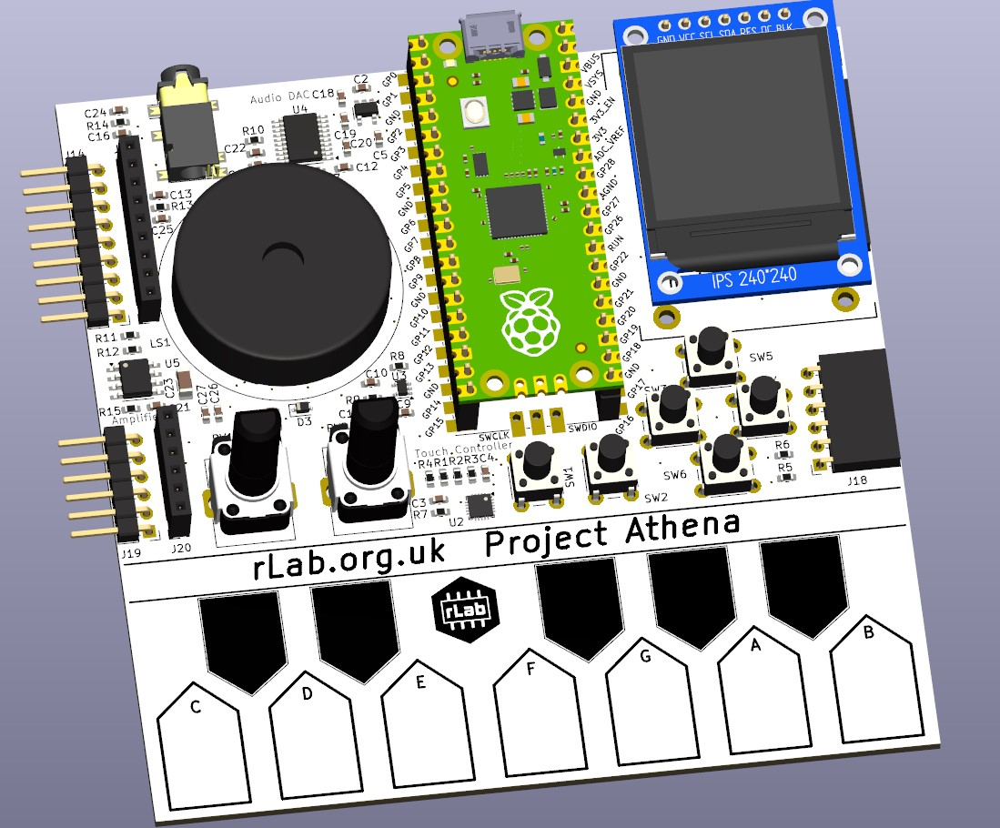

# Project Athena

A simple project to build and learn electronics and embedded design

## Objectives:
<ul>
<li>Develop individual and shared electronic design skills</li>
<li>Learn PCB design and build techniques with Kicad and external PCB manufacturers</li>
<li>Improve surface mount and through hole soldering skills</li>
<li>Familiarise with rLab electronics tools, equipment, and knowledge</li>
<li>Make a fun device</li>
</ul>

## Design Specification
Derived from the previous 555 Synth Punk build project
<ul>
<li>design should be Microprocessor based rather than 555</li>
<li>It should have a keyboard. This could be buttons, stylophone, touch sensor, or other. Probably single octave.</li>
<li>Cost components and board under £10</li>
<li>Improved Audio output using proper amplifier IC and board mounted speaker, possibly I2S codec</li>
<li>A couple of knobs and buttons to change sound settings</li>
<li>USB powered</li>
<li>Audio output jack</li>
<li>Mixture of surface mount and through hole components</li>
<li>LCD display integral</li> 
<li>Expansion connector to add new personalised features</li>
<li>C++ or Python programming.</li>
</ul>

## Design Approach
The design is built of modules which can be independently sourced, designed and prototyped before integration into a complete design.

## Proposed Modules
The following modules are proposed to be in the design, being available and at reasonable cost:

### Raspberry Pi Pico Processor Module

The Raspberry Pi Pico module is based on the RP2040 microprocessor. The module includes flash memory, power supply, crystal clock and a USB interface. It is an easy way to to integrate this processor without detail PCB layout and at attractive cost.
The Pi Pico Module have different variants which are pin compatible. They offer different USB Connectors(Micro-B, USB-C), Wireless and bluetooth integrated, and a higher performance version in the RP2350.
[Pi Pico Data sheet](https://datasheets.raspberrypi.com/pico/pico-datasheet.pdf)

The RP2040 is an ARM Cortex M0+ 32 bit processor which operates at 133MHz and includes a wide range of integrated peripherals.
[RP2040 Data sheet](https://datasheets.raspberrypi.com/rp2040/rp2040-datasheet.pdf)

High quality software support for the RP2040 and Pi Pico Modules is available in C/C++ ([C SDK](https://www.raspberrypi.com/documentation/microcontrollers/c_sdk.html), and [Arduino Pi Pico](https://www.tomshardware.com/how-to/program-raspberry-pi-pico-with-arduino-ide)), and Python([Micropython](https://www.raspberrypi.com/documentation/microcontrollers/micropython.html), and [CircuitPython](https://circuitpython.org/board/raspberry_pi_pico/))

### Capacitive touch Music Keyboard

A number of different keyboard switch types were considered including push butttons, stylophone type stylus and capacitive touch. The later was chosen for simplicity and the capability to play chords with multiple notes simultaneously.

A few different alternatives for the capacitive touch keyboard layout and interface were tested. The keyboard was prototyped with copper tape covered in kapton tape to simulate the PCB pads and solder mask in the final PCB. The Pi Pico does support direct connection of GPIO pins to interface capacitive touch switches using the CircuitPython [touchio library](https://docs.circuitpython.org/en/latest/shared-bindings/touchio/index.html), However it uses a lot of GPIO pins for a 12 key keyboard. It was decided to us a specialised Capacitive touch chip with and I2C interface [MPR121](https://www.nxp.com/docs/en/data-sheet/MPR121.pdf). This chip is very small and will present a good challenge in construction, however it is available already mounted on low cost modules for prototyping. The chip supports up to 4 different I2C addresses allowing additional octave to be added.

### PWM Audio Output
The Pi Pico supports PWM output to a GPIO pin for audio tone output. The resulting output is rather noisy as described in section 3.4.1 of the  [RP2040 hardware interface manual](https://datasheets.raspberrypi.com/rp2040/hardware-design-with-rp2040.pdf). It was choseb to implement the low noise 3.3V audio supply, the buffer, and the filter circuit.

### I2S Audio Codec
In addition to the PWM a I2S audio DAC is included for higher quality stereo output. The [PCM5102 DAC](https://www.ti.com/lit/ds/symlink/pcm5102.pdf) analog part is also powered from the low noise 3.3V supply

### Audio Amplifier and Loudspeaker

Low cost audio power amplifiers with 1W output power baaed on the LM386 are available. [LM386 module](https://www.switchelectronics.co.uk/products/lm386-audio-amplifier-board-200-gain-amplifier-module-power)

The LM386 IC can operate with few external components with a gain of 20 which is suitable for our application.[LM386 Data sheet](https://www.ti.com/lit/ds/symlink/lm386.pdf)

The loudspeaker is proposed to be board mounted.[30mm Loudspeaker](https://proto-pic.co.uk/product/speaker-30mm-dia-8-ohm-pcb-mounted)

Audio Output to an external amplifier is provided via a 3.5mm stereo jack.

### 1.3 inch IPs Colour LCD Display

A colour LCD display was chosen for the device. Limited space allows for a [240 by 240 pixel 1.3 inch IPS display](https://www.smart-prototyping.com/1_3-inch-TFT-IPS-Display-Module-ST7789-SPI-240-240).
The module is based on the ST7789 display IC and is supported by both Micropython and CircuitPython grahics libraries.

### Buttons and Potentiometers.

To interact with the device and display, two potentiometers and two push buttons are included.

### General Purpose Inputs and Outputs.

The board provides spare GPIO connections and power supplies on 2.54mm female headers for external experimental devices. The I2c Bus is also brought out to a connector to daisy chain octaves or add other I2C devices.

##   Estimated Costs
Derived from Kicad BOM. All including VAT and shipping.
<ul>
<li> PCB, 2 layer 100mm * 100mm JLCPCB      £0.75</li>
<li> Pi Pico 2040 module with micro USB     £1.75</li>
<li> 1.3in LCD Display 240 * 240 pixel      £1.75</li>
<li> Integrated circuits                    £1.25</li>
<li> Connectors                             £0.75</li>
<li> Buttons, Potentiometers                £0.50</li>

<li> Resistors, capacitors                  £0.75</li>
</ul>
Total: 

## PCB Files

## Software

